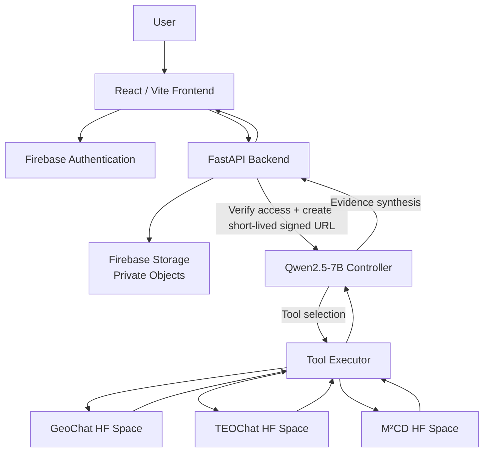

# AKASHA 🛰️

**Agentic Earth Observation Intelligence for Remote Sensing**

AKASHA is a modular remote-sensing analysis platform that combines a language-model controller with specialist Earth-observation models. Instead of forcing one model to perform every task, AKASHA treats specialized models as tools and routes each request through an agentic execution loop.

The system is designed for satellite-image question answering, grounded visual interpretation, temporal Earth-observation analysis, optical–SAR change detection, and related remote-sensing workflows.

> **Core idea:** use a lightweight controller to decide **what should be analyzed, which specialist should analyze it, and whether another tool is required**, then synthesize the resulting evidence into a user-facing answer.

---

## ✨ What AKASHA Does

AKASHA is built around four layers:

| Layer | Responsibility |
|---|---|
| **Frontend** | React/Vite interface for authentication, imagery upload, chat, sessions, and analysis output |
| **Backend** | FastAPI API, Firebase authentication/storage integration, authorization, signed-URL generation, and Qwen dispatch |
| **Controller** | Qwen2.5-7B-Instruct interprets the request, selects tools, executes multi-step workflows, and synthesizes results |
| **Specialists** | Remote-sensing models such as GeoChat, TEOChat, and M²CD exposed as independently hosted services |

The repository is intentionally modular so that a specialist model can be replaced or redeployed without rewriting the controller.

---

## 🧠 Agentic Architecture



### Controller loop

```text
User request
    ↓
Qwen controller
    ↓
Select specialist tool
    ↓
Execute tool
    ↓
Receive specialist evidence
    ↓
Decide whether another tool is needed
    ↓
Synthesize final answer
```

This pattern is inspired by the broader **model-and-tool orchestration** paradigm described by NVIDIA's *ToolOrchestra: Elevating Intelligence via Efficient Model and Tool Orchestration*. In that work, a smaller orchestrator coordinates specialized models and tools through multi-turn tool use rather than relying on one monolithic model. AKASHA applies the same architectural idea to Earth-observation workloads, while using Qwen2.5-7B-Instruct as the current controller. See [ToolOrchestra](https://arxiv.org/abs/2511.21689) and NVIDIA's [research page](https://research.nvidia.com/labs/lpr/ToolOrchestra/).

**Important:** AKASHA is inspired by the orchestration architecture; it does **not** claim to reproduce NVIDIA's training procedure or Nemotron-Orchestrator model.

---

## 🔬 Remote-Sensing Specialists

### GeoChat

[GeoChat](https://github.com/mbzuai-oryx/GeoChat) is a grounded large vision-language model for remote sensing. The original work targets high-resolution remote-sensing imagery and supports tasks including image/region captioning, visual question answering, scene classification, grounded conversations, and referring-object detection.

AKASHA uses GeoChat as a specialist for single prepared remote-sensing images.

Current hosted endpoint:

```text
Bireswar26/GeoChat
```

### TEOChat

[TEOChat](https://github.com/ermongroup/TEOChat) is a vision-language assistant designed for **temporal Earth-observation imagery**. It is intended for reasoning over image sequences and temporal change-related tasks.

AKASHA includes the TEOChat implementation under `models/TeoChat/` for temporal EO workflows.

### M²CD

[M²CD: A Unified MultiModal Framework for Optical-SAR Change Detection With Mixture of Experts and Self-Distillation](https://github.com/circleLZY/M2CD) is designed for multimodal optical–SAR change detection. The published work introduces modality-specialized mixture-of-experts components and an optical-to-SAR guided path/self-distillation strategy.

AKASHA includes the M²CD integration under `models/m2cd/` for optical–SAR change-detection workflows.

---

## 🤖 Controller Model

The current controller uses:

```text
Qwen/Qwen2.5-7B-Instruct
```

Qwen2.5 is an instruction-tuned language-model family with strong structured-output and instruction-following capabilities. The official model card documents support for structured generation, long context, and tool-oriented application patterns.

Reference:

- [Qwen2.5-7B-Instruct on Hugging Face](https://huggingface.co/Qwen/Qwen2.5-7B-Instruct)

Within AKASHA, Qwen is deliberately **not** the primary vision model. It acts as the controller/planner and delegates visual/scientific analysis to specialist tools.

---

## 🔐 Secure Image Flow

Production imagery is intended to remain private in Firebase Storage.

The backend follows this pattern:

```text
Firebase Storage object
        ↓
Authenticated FastAPI request
        ↓
Verify user ownership/access
        ↓
Generate short-lived signed read URL
        ↓
Call Qwen
        ↓
Qwen passes image URL to specialist
        ↓
Specialist performs inference
```

The signed URL is a temporary access capability. It should be treated as a secret, kept short-lived, never committed to source control, and not exposed to the browser unless explicitly required by the application.

The frontend should send a **Firebase Storage path/reference**, not a permanent public model-access URL.

---

## 🌐 Hosted Model Architecture

AKASHA separates application infrastructure from model inference:

```text
Firebase Hosting
    │
    ▼
React/Vite frontend
    │
    ▼
FastAPI backend on Cloud Run
    │
    ▼
Qwen2.5 controller on Hugging Face Spaces
    │
    ├── GeoChat Space
    ├── TEOChat Space
    └── M²CD Space
```

Specialist models are exposed through Gradio APIs and called through `gradio_client`.

This keeps the controller independent of the implementation details of each specialist. A specialist can move hosts or change its internal implementation while the controller continues to call the same logical tool contract.

---

## 📁 Repository Structure

```text
AKASHA/
├── agent/
│   └── qwen/
│       ├── controller/
│       │   ├── controller.py      # Agent loop / orchestration
│       │   ├── executor.py        # Tool transport + execution
│       │   ├── model.py           # Qwen2.5 controller model
│       │   ├── prompts.py         # Controller policy/instructions
│       │   ├── services.py        # Hosted specialist configuration
│       │   └── tools.py           # Tool schemas / registry
│       └── tests/
│
├── backend/
│   ├── api/
│   │   ├── routes.py              # FastAPI endpoints
│   │   └── schemas.py             # Request/response models
│   ├── services/
│   │   ├── firebase_service.py    # Firebase Auth + Storage
│   │   └── qwen_service.py        # Qwen Gradio client
│   ├── config.py
│   ├── main.py
│   ├── Dockerfile
│   └── requirements.txt
│
├── frontend/
│   ├── src/
│   │   ├── components/
│   │   ├── firebaseClient.js
│   │   ├── App.jsx
│   │   └── ...
│   ├── firebase.json
│   ├── storage.rules
│   ├── package.json
│   └── vite.config.js
│
├── models/
│   ├── geochat/
│   ├── TeoChat/
│   └── m2cd/
│
├── docs/
├── scripts/
└── LICENSE
```

---

## 🚀 Quick Start

### 1. Clone

```bash
git clone https://github.com/Bireswar-Sett/Akasha.git
cd Akasha
```

### 2. Backend

```bash
cd backend
python -m venv .venv
source .venv/bin/activate
python -m pip install -r requirements.txt
```

Create a local environment file from the example:

```bash
cp .env.example .env
```

Configure at least the Qwen/Firebase values expected by the backend.

### 3. Frontend

```bash
cd ../frontend
npm ci
npm run build
```

For local development:

```bash
npm run dev
```

### 4. Run FastAPI locally

From `backend/`:

```bash
uvicorn main:app --reload --port 8000
```

Health endpoint:

```text
GET /api/status
```

---

## 🔌 API

### `GET /`

Basic backend health response.

### `GET /api/status`

Returns service/configuration status without performing model inference.

### `POST /api/analyze`

Primary production analysis endpoint.

Request:

```json
{
  "image_path": "users/<uid>/imagery/image_001.png",
  "query": "Describe the visible buildings and their spatial arrangement.",
  "max_new_tokens": 256
}
```

The backend authenticates the Firebase user, verifies storage access, creates a short-lived signed URL, and dispatches the request to the Qwen controller.

Conceptual response:

```json
{
  "answer": "..."
}
```

---

## 🧰 Tool Interface

The controller exposes specialist capabilities through typed tool definitions.

A GeoChat call is conceptually represented as:

```json
{
  "name": "geochat",
  "arguments": {
    "image_url": "https://...",
    "prompt": "Describe the visible features.",
    "max_new_tokens": 256
  }
}
```

Qwen decides **which capability to invoke**. The executor decides **how that capability is reached**.

This separation is deliberate:

```text
Qwen
  = planning / routing / synthesis

Executor
  = transport / authentication / invocation

Specialist
  = domain-specific inference
```

---

## 🛰️ SAR Representation

For the current SAR-to-RGB preprocessing used for GeoChat-compatible visualization, Sentinel-1 VV/VH inputs are converted into a pseudo-RGB representation:

```text
R = VV
G = VH
B = (VV + VH) / 2
```

This deterministic transformation is implemented separately from the language-model controller so that the controller does not perform low-level image processing itself.

---

## ☁️ Deployment

### Frontend

The frontend is designed for Firebase Hosting.

```bash
cd frontend
npm ci
npm run build
firebase deploy --only hosting
```

### Backend

The FastAPI service is containerized for deployment to Google Cloud Run.

```bash
cd backend

gcloud run deploy akasha-backend \
  --source . \
  --region us-central1
```

The Firebase Hosting configuration can route `/api/**` traffic to the Cloud Run service.

### Qwen controller

The controller can run as a Gradio Hugging Face Space and exposes:

```text
/ask_akasha
```

The current hosted controller is:

```text
AdityaSingh1531/qwen
```

### Specialist models

Specialist models are independently hosted and exposed through Gradio APIs. The controller communicates through `gradio_client` rather than importing specialist model code directly.

---

## 🔑 Environment Variables

Never commit credentials to the repository.

Typical backend configuration includes:

```env
FIREBASE_PROJECT_ID=...
FIREBASE_STORAGE_BUCKET=...
QWEN_SPACE=AdityaSingh1531/qwen
HF_TOKEN=...
SIGNED_URL_EXPIRATION_SECONDS=300
```

The exact set of variables is determined by `backend/.env.example` and the deployed infrastructure configuration.

For Hugging Face Spaces, store authentication tokens in **Space Secrets**, not in source files.

---

## 🧪 Testing

### Backend

```bash
cd backend
pytest -q
```

### Qwen controller

Controller tests live under:

```text
agent/qwen/tests/
```

### GeoChat

GeoChat-specific compatibility and inference tests live under:

```text
models/geochat/tests/
```

The test suite covers configuration, checkpoint compatibility, vision processing, multimodal forward passes, generation, and SAR preprocessing.

---

## 🧩 Design Principles

### Specialist models are tools, not dependencies

Qwen does not import GeoChat, TEOChat, or M²CD internally. The controller sees tool contracts, while the executor handles transport.

### Deterministic processing stays deterministic

Operations such as SAR pseudo-RGB construction are implemented as explicit processing functions rather than delegated to the language model.

### Evidence before synthesis

The controller is instructed not to invent visual observations. Specialist outputs are treated as evidence, and the final answer is synthesized only after tool execution.

### Private data stays private

Firebase Storage is the intended source of truth for user imagery. Signed URLs are temporary capabilities used for inference rather than permanent public storage links.

### Replaceable infrastructure

The controller should remain stable when a specialist moves from one serving platform to another. Only the executor/service configuration should need to change.

---

## 📚 Research & References

### Controller / agentic orchestration

**Su et al. — ToolOrchestra: Elevating Intelligence via Efficient Model and Tool Orchestration**

NVIDIA + University of Hong Kong, 2025.

- Paper: https://arxiv.org/abs/2511.21689
- NVIDIA research page: https://research.nvidia.com/labs/lpr/ToolOrchestra/

ToolOrchestra presents the idea of using an orchestrator to coordinate specialized models and tools through multi-turn interaction, with a focus on performance, efficiency, and tool selection. AKASHA adapts this architectural principle to remote-sensing analysis rather than reproducing the original model or training recipe.

### Controller foundation model

**Qwen2.5-7B-Instruct**

- Hugging Face model card: https://huggingface.co/Qwen/Qwen2.5-7B-Instruct
- Qwen GitHub: https://github.com/QwenLM/Qwen2.5

### Remote-sensing visual-language reasoning

**Mou et al. — GeoChat: Grounded Large Vision Language Model for Remote Sensing**

CVPR 2024.

- Official repository: https://github.com/mbzuai-oryx/GeoChat

GeoChat is a grounded vision-language model designed specifically for remote-sensing imagery and supports region-aware interpretation and several remote-sensing VQA/captioning tasks.

### Temporal Earth observation reasoning

**Irvin et al. — TEOChat: A Large Vision-Language Assistant for Temporal Earth Observation Data**

ICLR 2025.

- Official repository: https://github.com/ermongroup/TEOChat
- arXiv: https://arxiv.org/abs/2410.06234

TEOChat focuses on reasoning over temporal sequences of Earth-observation imagery.

### Optical–SAR change detection

**Liu et al. — M²CD: A Unified MultiModal Framework for Optical-SAR Change Detection With Mixture of Experts and Self-Distillation**

IEEE Geoscience and Remote Sensing Letters, 2025.

- Official implementation: https://github.com/circleLZY/M2CD
- DOI: https://doi.org/10.1109/LGRS.2025.3590959
- arXiv: https://arxiv.org/abs/2503.19406

M²CD addresses heterogeneous optical–SAR change detection with modality-aware mixture-of-experts components and self-distillation.

---

## ⚖️ Attribution & Licensing

The root project is distributed under the **Apache License 2.0**.

Third-party model implementations, checkpoints, datasets, and dependencies may have their own licenses and terms. Users must comply with the respective upstream licenses when redistributing or deploying those components.

In particular, GeoChat, TEOChat, M²CD, Qwen, and their associated assets should be treated according to their respective upstream project/model licenses and attribution requirements.

See [`LICENSE`](./LICENSE) for the project license.

---

## ⚠️ Current Scope

The repository contains the controller architecture and multiple specialist integrations, but the currently registered Qwen tool set should be treated as the source of truth for what is active in a given deployment. At the current stage, the controller's primary deployed specialist path is GeoChat; TEOChat and M²CD are included for the broader remote-sensing workflow and subsequent orchestration expansion.

Model quality and outputs depend on the upstream specialist models, input data quality, preprocessing, serving infrastructure, and task formulation. AKASHA is an analysis assistant and should not be treated as a substitute for domain-expert validation in high-stakes geospatial decisions.

---

## 🌍 Project Vision

AKASHA aims to turn remote-sensing foundation models into a **coordinated intelligence system** rather than a collection of disconnected demos.

The long-term goal is a controller that can:

- interpret a natural-language Earth-observation task,
- determine which modalities and dates are relevant,
- select and sequence specialized models,
- perform deterministic preprocessing when required,
- combine textual and spatial evidence,
- estimate or expose confidence and execution provenance, and
- return an auditable, useful analysis to the user.

In other words: not just **"run a satellite model"**, but **"figure out which satellite model should run, run it, understand what it found, and know when another model is necessary."**

---

## 👥 Project

**AKASHA** — Agentic Remote-Sensing Intelligence Platform

Repository: https://github.com/Bireswar-Sett/Akasha

Built as a modular research/prototype system for Earth-observation analysis, agentic orchestration, and multimodal remote sensing.
